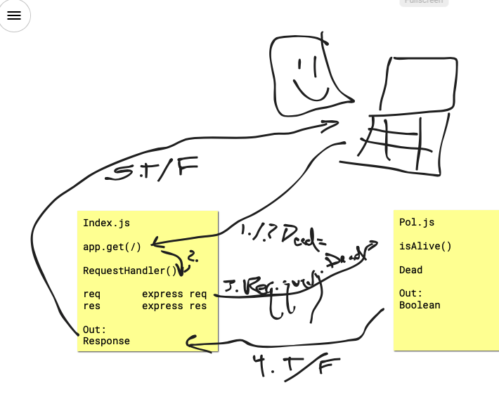

# LAB - Class 00

## Project: Proof of Life Server

### Author: Daniel Nguyen

### Links and Resources

- [submission PR](https://github.com/daniel-nguyen-401-advanced-javascript/lab-00/pull/1)
- [travis](https://travis-ci.com/github/daniel-nguyen-401-advanced-javascript/lab-00)
- [ci/cd](http://xyz.com) (GitHub Actions)
  - Have not seen tutorial on GitHub Actions yet but will use that going forward
- [back-end server url](http://xyz.com) (when applicable)
- [front-end application](https://daniel-nguyen-lab-00.herokuapp.com) (when applicable)

#### Documentation
- [jsdoc](https://daniel-nguyen-lab-00.herokuapp.com/docs/)

### Modules
#### `pol.js`
##### Exported Values and Methods

##### `isAlive(dead) -> boolean`
Returns true/false to indicate how the server works

### Setup

#### `.env` requirements (where applicable)
- `PORT` - Port Number

#### How to initialize/run your application (where applicable)

- `npm start`
- Endpoint: `/`
  - Returns a boolean
- Endpoint: `/docs`
  - Returns JSDoc Documentation Pages

#### How to use your library (where applicable)

#### Tests

- How do you run tests?
- Any tests of note?
- Describe any tests that you did not complete, skipped, etc 

- Unit Tests: `npm test`
- Lint Tests: `npm run lint`

#### UML

